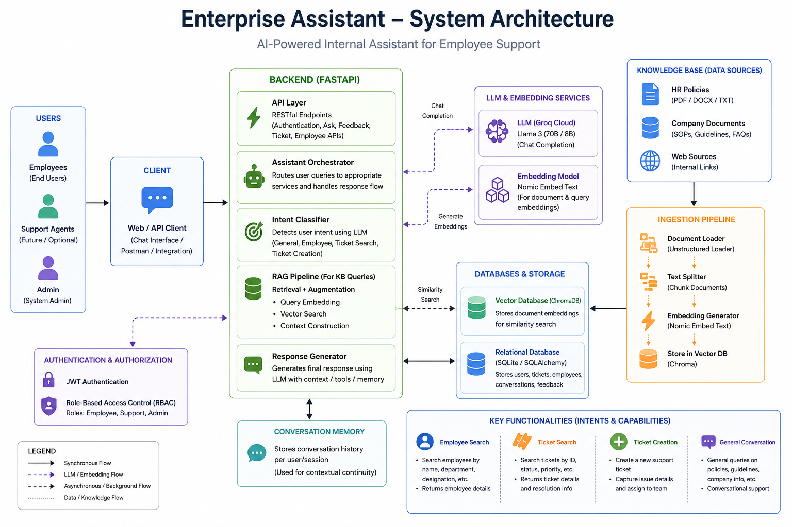

# Enterprise Assistant v2.0

An AI-powered Enterprise Assistant built with **FastAPI**, **Groq**, **PostgreSQL**, and **ChromaDB** that enables employees to retrieve company knowledge, search employee information, manage IT support tickets, and maintain context-aware conversations through Retrieval-Augmented Generation (RAG) and persistent conversation memory.

---

## Overview

Enterprise Assistant is a backend application that demonstrates how Large Language Models can be integrated into enterprise software using modern backend technologies.

The application combines Retrieval-Augmented Generation (RAG), structured business data, authentication, and conversational memory into a single API capable of understanding user intent and performing multiple enterprise workflows.

The project has been designed using a modular architecture that separates authentication, business logic, database operations, AI orchestration, and retrieval pipelines to ensure maintainability and scalability.

---

## Features

* AI-powered conversational assistant using Groq LLM
* Retrieval-Augmented Generation (RAG) using ChromaDB
* Employee directory search
* IT support ticket creation and retrieval
* JWT-based authentication and authorization
* Persistent conversation memory
* PostgreSQL database with SQLAlchemy ORM
* Alembic database migrations
* Dockerized deployment
* Automatic interactive API documentation using FastAPI Swagger

---

## Technology Stack

| Category           | Technologies           |
| ------------------ | ---------------------- |
| Backend            | FastAPI                |
| Language           | Python                 |
| ORM                | SQLAlchemy 2.0         |
| Database           | PostgreSQL             |
| Authentication     | JWT                    |
| AI Provider        | Groq                   |
| LLM Framework      | LangChain              |
| Vector Database    | ChromaDB               |
| Embedding Model    | Sentence Transformers  |
| Database Migration | Alembic                |
| Containerization   | Docker, Docker Compose |

---

## System Architecture




---

## Project Structure

```text
Enterprise-Assistant/
│
├── alembic/
├── app/
│   ├── auth/
│   ├── core/
│   ├── database/
│   ├── models/
│   ├── rag/
│   ├── routers/
│   ├── services/
│   └── utils/
│
├── screenshots/
├── Dockerfile
├── docker-compose.yml
├── requirements.txt
├── README.md
├── API_DOCUMENTATION.md
├── .env.example
└── alembic.ini
```

---

## Core Components

### Authentication

Users authenticate using JWT tokens. Protected endpoints require a valid bearer token before requests are processed.

---

### Enterprise Assistant

The Assistant Service acts as the central orchestration layer.

It is responsible for:

* Intent classification
* Employee lookup
* Ticket management
* RAG-based question answering
* Conversation memory integration
* Response generation

---

### Retrieval-Augmented Generation (RAG)

The RAG pipeline retrieves relevant company documents from ChromaDB before sending context to the language model.

Workflow:

1. User submits a question.
2. Relevant documents are retrieved.
3. Context is combined with the prompt.
4. Groq generates the final response.

This approach produces responses grounded in organizational knowledge instead of relying solely on the language model.

---

### Conversation Memory

Conversation history is stored in PostgreSQL.

Each conversation receives a unique `conversation_id`, allowing follow-up questions to retain context throughout the interaction.

---

### Ticket Management

The assistant can:

* Create support tickets
* Retrieve existing tickets
* Answer ticket-related questions

The user interacts naturally without needing separate endpoints for different ticket operations.

---

### Employee Directory

The assistant can retrieve employee information such as:

* Name
* Department
* Email
* Position

through natural language queries.

---

## Installation

### Clone the repository

```bash
git clone <repository-url>
cd Enterprise-Assistant
```

---

### Create the environment file

Copy the example configuration.

```bash
cp .env.example .env
```

Update the values with your own credentials.

---

### Docker Deployment

Build and start the application.

```bash
docker compose up --build
```

Run in detached mode.

```bash
docker compose up -d
```

Stop the containers.

```bash
docker compose down
```

---

## Local Development

Create a virtual environment.

```bash
python -m venv venv
```

Activate the environment.

Windows

```bash
venv\Scripts\activate
```

Linux/macOS

```bash
source venv/bin/activate
```

Install dependencies.

```bash
pip install -r requirements.txt
```

Run the application.

```bash
uvicorn app.main:app --reload
```

---

## Environment Variables

The application uses environment variables for configuration.

Example:

```text
DATABASE_URL=

LLM_PROVIDER=

LLM_API_KEY=

LLM_MODEL=

SECRET_KEY=

ALGORITHM=HS256

ACCESS_TOKEN_EXPIRE_MINUTES=30
```

A complete template is provided in `.env.example`.

---

## API Documentation

Interactive Swagger documentation is available once the application is running.

```text
http://localhost:8000/docs
```

Detailed API documentation can be found in:

```text
API_DOCUMENTATION.md
```

---

## Screenshots

Add screenshots demonstrating:

* Login
* Swagger UI
* Employee lookup
* Ticket management
* AI assistant responses

---

## Security

The project incorporates several security best practices:

* JWT authentication
* Password hashing using bcrypt
* Environment-based secret management
* SQLAlchemy ORM to prevent SQL injection
* Input validation using Pydantic
* Centralized exception handling

---

## Deployment

The application has been designed for containerized deployment and is compatible with platforms such as Render, Azure App Service, Azure Container Apps, AWS ECS, and Google Cloud Run.

Due to free-tier limitations around persistent storage for the vector database, a public deployment is not currently maintained.

The application can be launched locally using Docker Compose using the setup instructions provided in this repository.

---

## License

This project is licensed under the MIT License.

---

## Author

**Ankit Verma**

MSc Applied Artificial Intelligence

Backend & AI Developer

GitHub: (*https://github.com/ankit-s-verma*)

LinkedIn: (*https://www.linkedin.com/in/ankit-s-verma/*)
