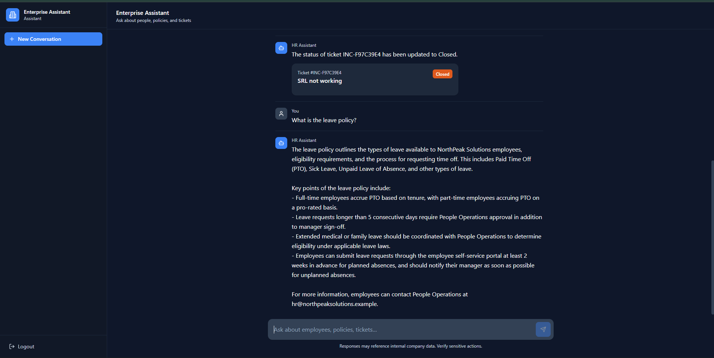
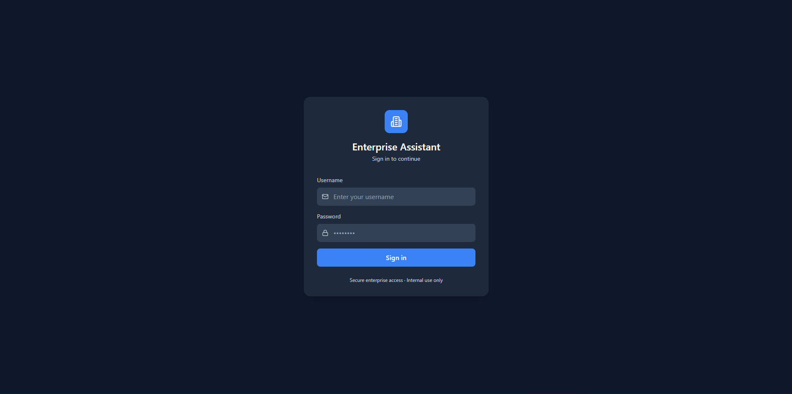
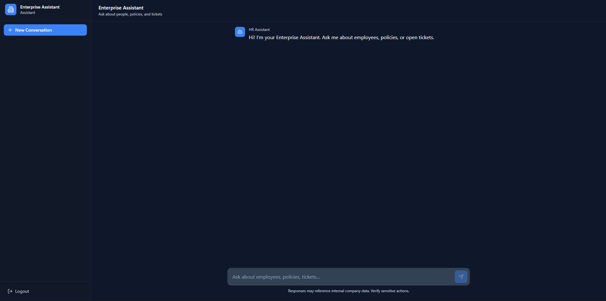
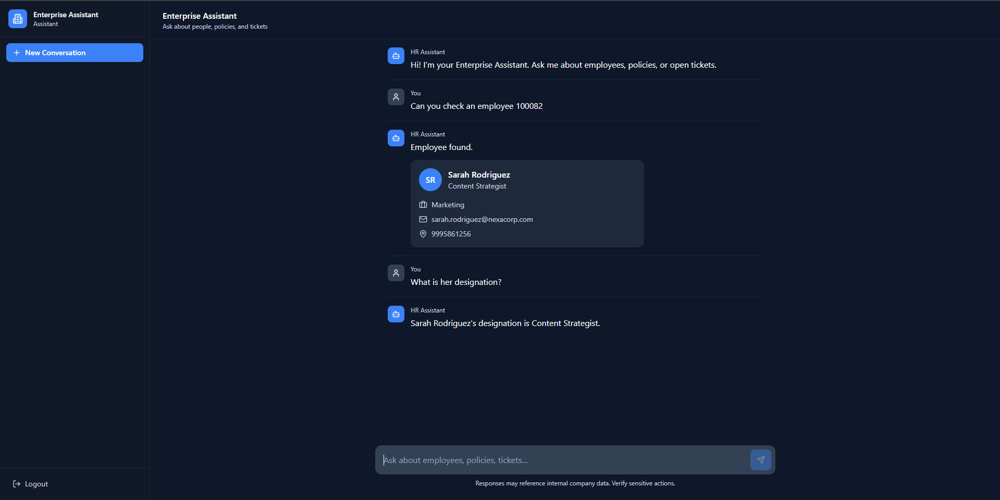
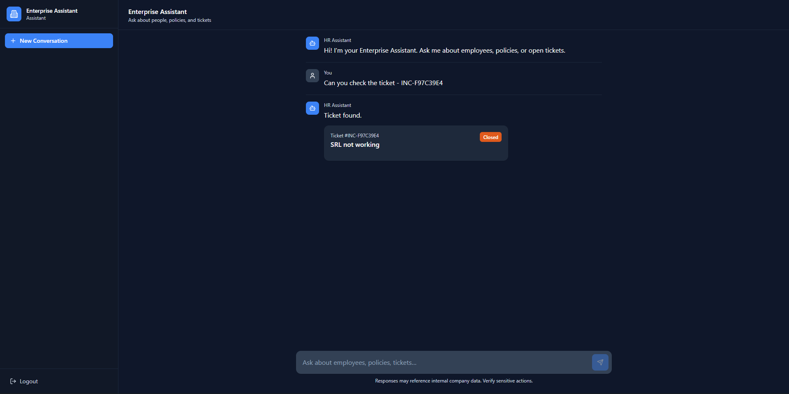
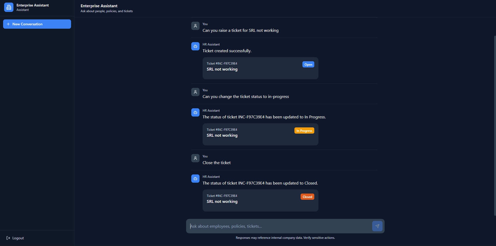

# Enterprise HR Assistant

<p align="center">
  
</p>


</p>

An AI-powered **Enterprise HR Assistant** that enables employees to search employee information, create and manage IT support tickets, and ask organization-specific questions through natural language conversations. The application combines **LangGraph**, **Retrieval-Augmented Generation (RAG)**, **Groq LLM**, **FastAPI**, **React**, and **PostgreSQL** to deliver a modern enterprise AI experience.

---

# Features

### Authentication

- JWT Authentication
- Protected Routes
- Auto Login
- Logout
- Axios Request & Response Interceptors

### AI Assistant

- General HR conversations
- Company policy Q&A using RAG
- Context-aware follow-up questions
- Conversation memory

### Employee Management

- Employee Search
- Employee Profile Cards
- Context-aware employee follow-ups

### Ticket Management

- Ticket Search
- Ticket Creation
- Ticket Updates
- Ticket Cards
- Ticket conversational memory

### Frontend

- Modern React UI
- Dark enterprise theme
- Responsive layout
- Thinking indicator
- New conversation support

### Deployment

- Dockerized frontend
- Dockerized backend
- PostgreSQL
- Docker Compose

---

# System Architecture

<p align="center">

</p>

---

# Technology Stack

| Category | Technologies |
|------------|--------------|
| Frontend | React 18, TypeScript, Tailwind CSS, Vite |
| Backend | FastAPI, Python |
| AI | LangGraph, LangChain, Groq |
| Database | PostgreSQL, SQLAlchemy |
| Vector Store | ChromaDB |
| Authentication | JWT |
| Containerization | Docker, Docker Compose |
| Web Server | Nginx |

---

# Project Structure

```text
Enterprise-HR-Assistant/
│
├── alembic/
│
├── backend/
│   ├── auth/
│   ├── chroma_db/
│   ├── core/
│   ├── database/
│   ├── knowledge_base/
│   ├── llm/
│   ├── memory/
│   ├── models/
│   ├── rag/
│   ├── repositories/
│   ├── routes/
│   ├── schemas/
│   ├── services/
│   ├── utils/
│   ├── Dockerfile
│   ├── main.py
│   └── requirements.txt
│
├── frontend/
│   ├── public/
│   ├── src/
│   │   ├── components/
│   │   ├── pages/
│   │   ├── services/
│   │   ├── types/
│   │   ├── utils/
│   │   └── App.tsx
│   │
│   ├── Dockerfile
│   ├── nginx.conf
│   ├── package.json
│   └── vite.config.ts
│
├── screenshots/
│
├── docker-compose.yml
├── API_Documentation.md
├── README.md
├── LICENSE
└── .env.example
```

---

# Screenshots

## Login



---

## Chat Interface



---

## Employee Search



---

## Ticket Search



---

## Ticket Creation & Update



---

# Getting Started

## Clone Repository

```bash
git clone https://github.com/ankit-s-verma/Enterprise-HR-Assistant.git

cd Enterprise-HR-Assistant
```

---

## Environment Variables

Create a `.env` file in the project root.

```env
DATABASE_URL=

SECRET_KEY=

GROQ_API_KEY=

MODEL_NAME=

ACCESS_TOKEN_EXPIRE_MINUTES=60
```

---

## Run with Docker

The easiest way to run the application.

```bash
docker compose up --build
```

Application URLs:

| Service | URL |
|----------|-----|
| Frontend | http://localhost |
| Backend | http://localhost:8000 |
| Swagger UI | http://localhost:8000/docs |

---

## Local Development

### Backend

```bash
cd backend

pip install -r requirements.txt

uvicorn main:app --reload
```

### Frontend

```bash
cd frontend

npm install

npm run dev
```

---

# API Documentation

Interactive Swagger documentation is available at:

```
http://localhost:8000/docs
```

Detailed endpoint documentation can be found in:

```
API_Documentation.md
```

---

# License

This project is licensed under the MIT License. See the [LICENSE](LICENSE) file for details.

---

# Author

## Ankit Verma

**AI & Machine Learning Engineer | Python Developer**

GitHub:
https://github.com/ankit-s-verma

LinkedIn:
https://www.linkedin.com/in/ankit-s-verma/