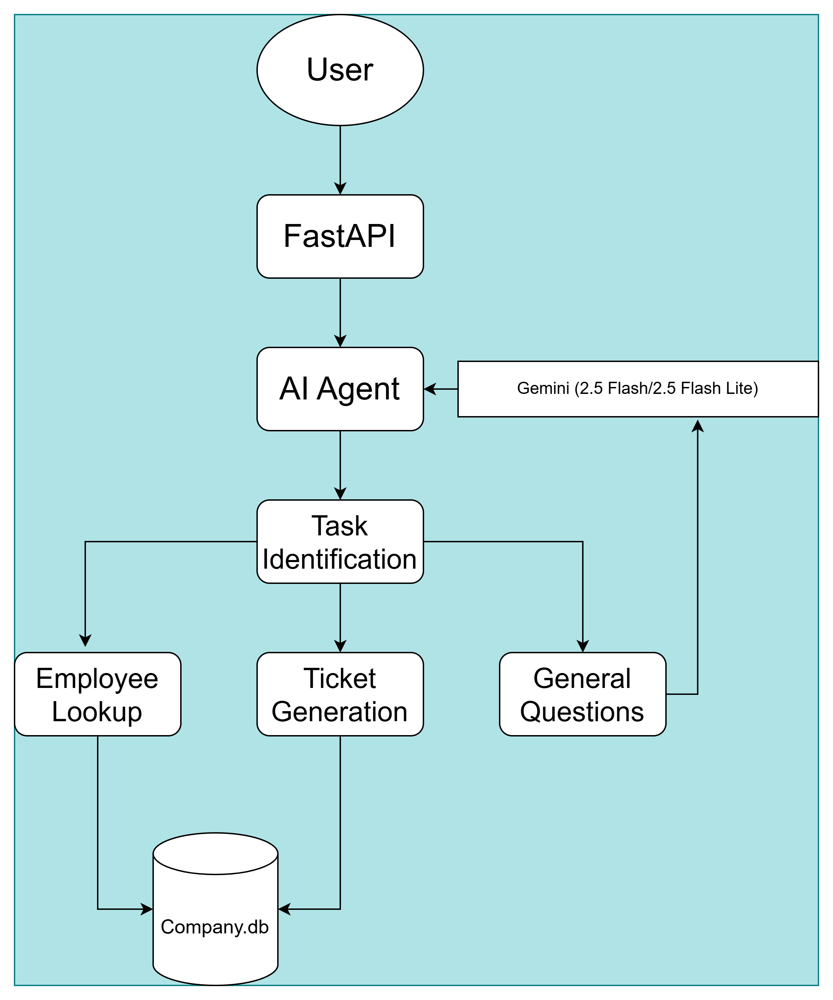
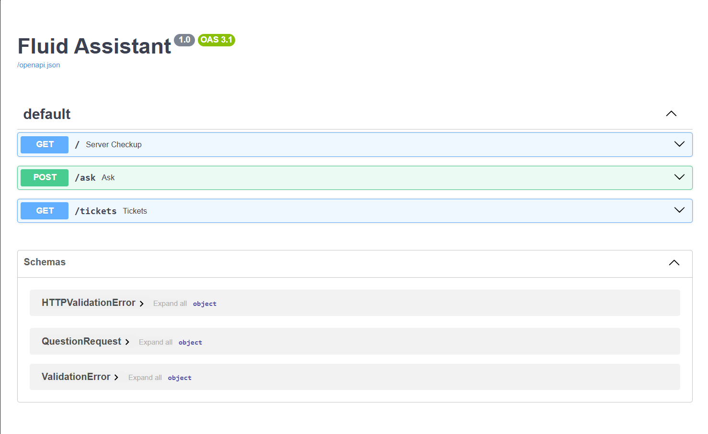
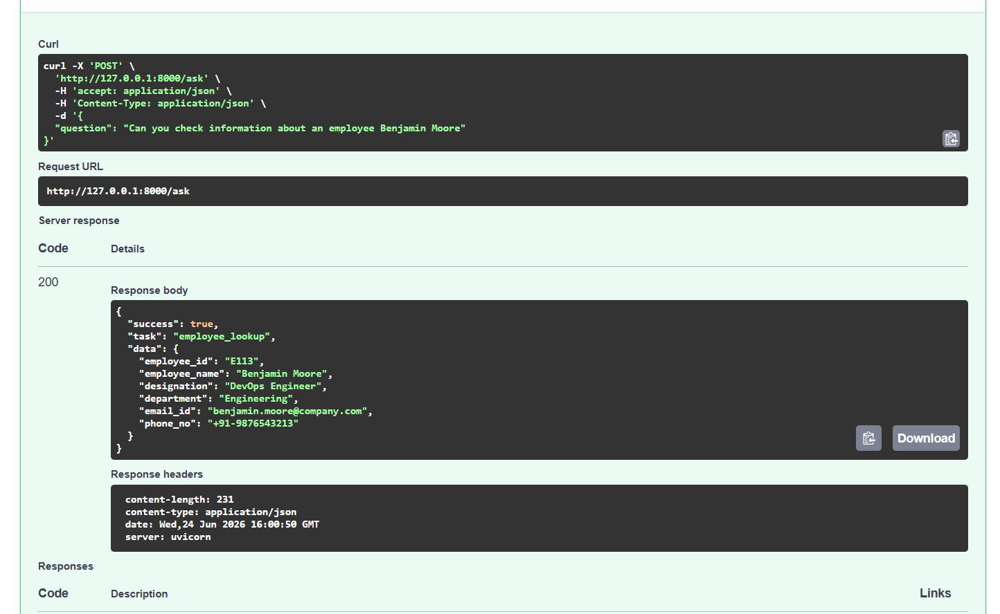
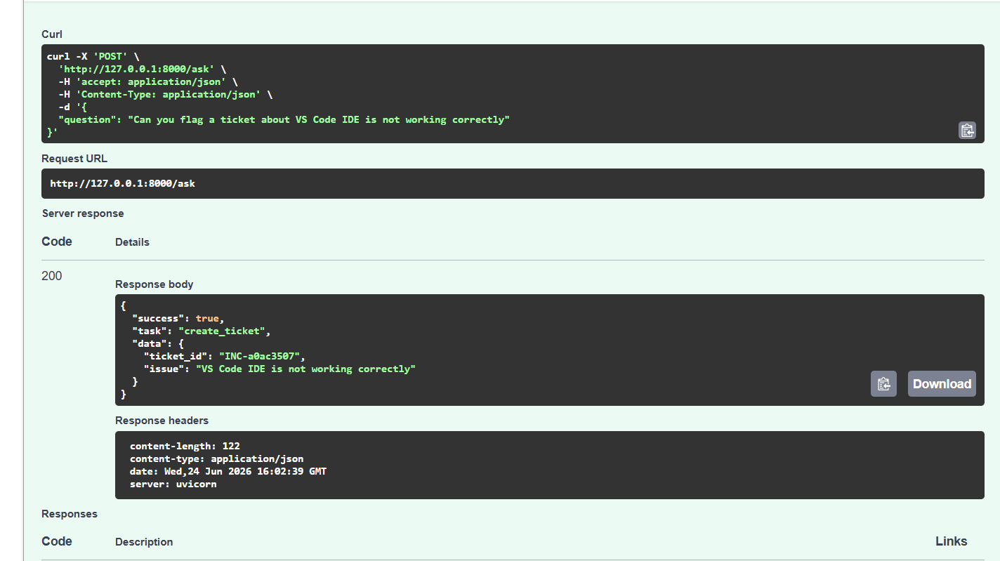
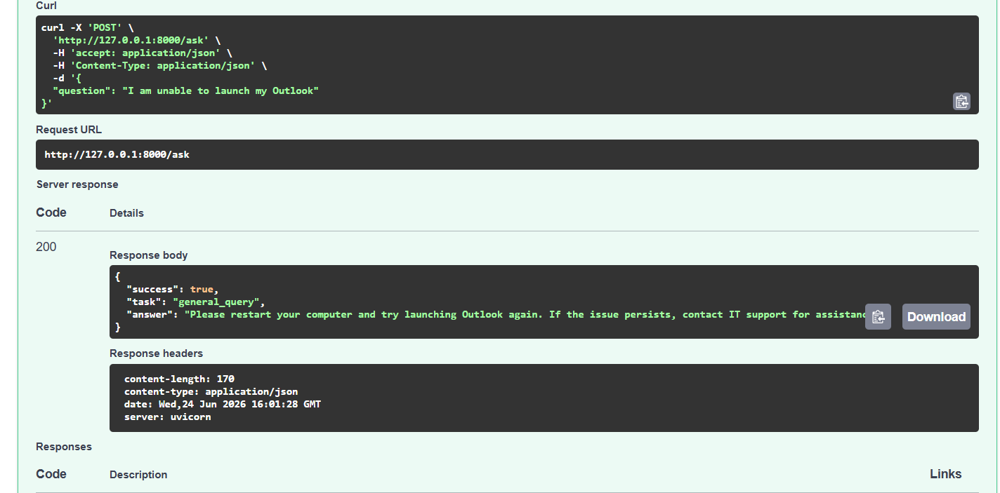
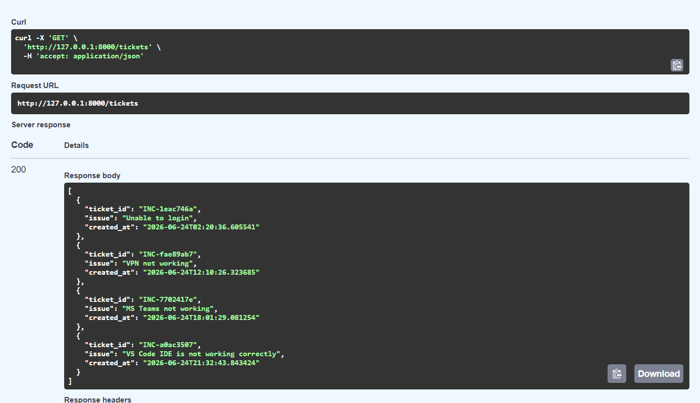

# Enterprise HR Assistant

An AI-powered enterprise assistant built with FastAPI, SQLite, and Google Gemini. The application can understand natural language requests, retrieve employee information, create support tickets, and answer general enterprise-related questions through a unified API interface.

---

## Highlights

* AI-powered intent extraction using Google Gemini
* Employee information retrieval from SQLite
* Support ticket creation workflow
* FastAPI REST API with interactive Swagger documentation
* Pydantic request validation
* Structured tool-routing architecture
* Persistent ticket storage
* Modular service-based backend design
* Error handling and fallback logic

---

## System Architecture



---

## Features

### Employee Information Lookup

Retrieve employee information using natural language queries.

**Examples**

```text
Show details of employee E105
Get information about Sarah Johnson
Find employee E110
```

### IT Support Ticket Creation

Create support tickets through conversational requests.

**Examples**

```text
Create a ticket for VPN connectivity issues
Unable to login to company portal
My laptop is not working
```

### General Enterprise Queries

Answer HR and enterprise-related questions using an LLM.

**Examples**

```text
What is employee onboarding?
What is the leave approval process?
Explain the onboarding workflow
```

### AI-Powered Intent Routing

The assistant uses a language model to classify user intent and route requests to the appropriate business workflow rather than relying on hardcoded keyword matching.

---

## Technology Stack

### Backend

* FastAPI
* Python 3.11

### Database

* SQLite

### AI Layer

* Google Gemini
* Intent Extraction
* Tool Routing

### Validation

* Pydantic

---
## Demo Screenshots

### Swagger UI



### Employee Lookup



### Ticket Generation



### General Query



### All Tickets



---
## Project Structure

```text
enterprise-hr-assistant/
│
├── app/
│   │
│   ├── main.py
│   │
│   ├── agents/
│   │   └── ai_agent.py
│   │
│   ├── database/
│   │   ├── database.py
│   │   └── employees.db
│   │
│   ├── services/
│   │   ├── employee_service.py
│   │   └── ticket_service.py
│   │
│   ├── models/
│   │   └── models.py
│   │
│   └── data/
│       └── employees.csv
│
├── screenshots/
│   ├── architecture.png
│   ├── swagger-ui.png
│   ├── employee-lookup.png
│   ├── ticket-generation.png
│   ├── all-tickets.png
│   └── general-query.png
│
├── .gitignore
├── requirements.txt
├── README.md
└── LICENSE
```

---

## Installation

### Clone the Repository

```bash
git clone https://github.com/<your-username>/enterprise-hr-assistant.git
cd enterprise-hr-assistant
```

### Create Virtual Environment

#### Windows

```bash
python -m venv venv
venv\Scripts\activate
```

#### Linux / Mac

```bash
python -m venv venv
source venv/bin/activate
```

### Install Dependencies

```bash
pip install -r requirements.txt
```

---

## Environment Variables

Create a `.env` file in the project root.

```env
GEMINI_API_KEY=your_api_key_here
```

---

## Running the Application

Start the FastAPI server:

```bash
uvicorn app.main:app --reload
```

Application URL:

```text
http://127.0.0.1:8000
```

Interactive API Documentation:

```text
http://127.0.0.1:8000/docs
```

---

## API Usage

### POST /ask

#### Request

```json
{
  "question": "Show details of employee E105"
}
```

#### Employee Lookup Response

```json
{
  "success": true,
  "action": "employee_lookup",
  "data": {
    "employee_id": "E105",
    "employee_name": "Michael Wilson",
    "designation": "Software Engineer",
    "department": "Engineering",
    "email_id": "michael.wilson@company.com",
    "phone_no": "+91-9876543205"
  }
}
```

---

#### Ticket Creation Request

```json
{
  "question": "Unable to login to company portal"
}
```

#### Ticket Creation Response

```json
{
  "success": true,
  "action": "ticket_created",
  "data": {
    "ticket_id": "INC-12345",
    "status": "OPEN"
  }
}
```

---

## AI Workflow

### Step 1: User Query

```text
Show details of employee E105
```

### Step 2: Intent Extraction

The language model converts the natural language query into structured data.

```json
{
  "action": "EMPLOYEE_LOOKUP",
  "employee_id": "E105"
}
```

### Step 3: Tool Routing

The application routes the request to the appropriate business service.

```text
EMPLOYEE_LOOKUP
      ↓
Employee Service
      ↓
SQLite Query
```

### Step 4: Response Generation

The result is returned to the user through the API.

---

## Key Concepts Demonstrated

* FastAPI API Development
* RESTful Service Design
* Large Language Model Integration
* AI Agent Workflows
* Tool Calling / Function Routing
* SQLite Database Operations
* Request Validation with Pydantic
* Error Handling and Fallback Logic
* Service-Oriented Architecture
* Enterprise Workflow Automation

---

## Design Decisions

### SQLite vs PostgreSQL

SQLite was selected to simplify deployment while still demonstrating database integration and persistence. The architecture can be migrated to PostgreSQL with minimal modifications.

### LLM-Based Routing vs Keyword Matching

The assistant uses AI-driven intent extraction instead of hardcoded keyword matching. This approach provides greater flexibility and serves as a foundation for future agent-based workflows.

### Modular Architecture

The application is organized into dedicated modules for AI processing, database operations, business services, and API endpoints to improve maintainability and scalability.

---

## Future Enhancements

* PostgreSQL Integration
* SQLAlchemy ORM
* User Authentication
* Role-Based Access Control (RBAC)
* Retrieval-Augmented Generation (RAG)
* Conversation Memory
* Ticket Status Tracking
* Department-Based Employee Search
* Multi-Agent Workflows
* Docker Deployment

---

## Author

**Ankit Verma**

AI & Machine Learning Engineer | Python Developer
```
```
